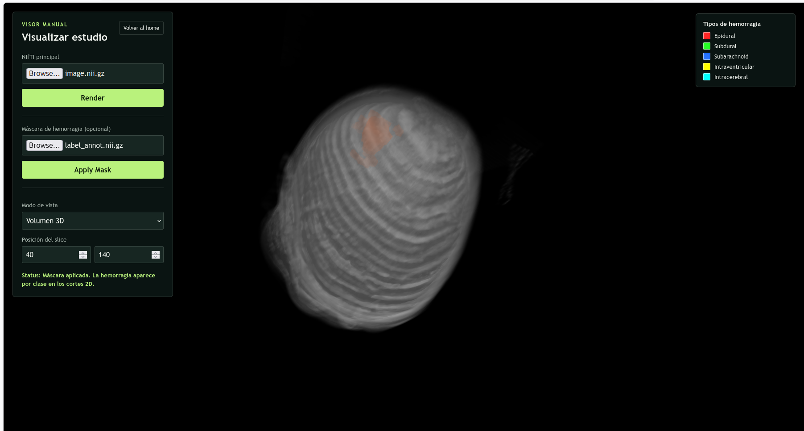
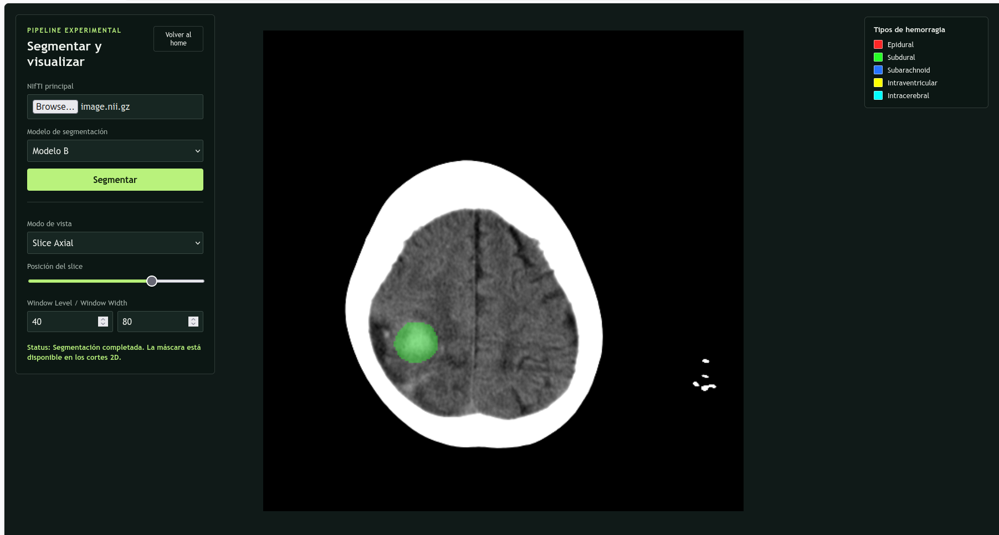

# MBH_App




Application web to visualize and segment brain hemorrhages in CT images (NIfTI volumes).

Part of the MICCAI brain hemorrhage segmentation/classification project. This app renders CT volumes in the browser, lets you inspect them slice-by-slice or as a full 3D volume, and overlays voxel-level segmentation masks — either uploaded manually or generated by one of the trained deep learning models through a local inference backend.

> **Academic prototype notice:** this project was trained on a limited dataset (~191 voxel-annotated cases). It is intended as a technical/portfolio demonstration, **not** as a clinical or diagnostic tool.

## Table of contents

- [Features](#features)
- [Project structure](#project-structure)
- [Requirements](#requirements)
- [Setup](#setup)
- [Running the app (development)](#running-the-app-development)
- [Building for production](#building-for-production)
- [Known limitations](#known-limitations)
- [License](#license)

## Features

- Load NIfTI (`.nii` / `.nii.gz`) CT volumes directly in the browser.
- Two visualization modes: full 3D volume render, and 2D slice-by-slice view (axial/coronal/sagital) with HU windowing for clear brain detail.
- Manual mask overlay: upload your own segmentation mask to inspect it alongside the scan.
- Automatic segmentation: send a scan to the local inference backend and visualize the predicted mask, with a color legend per hemorrhage subtype.
- Two working inference models (SegResNet 2D and ViolaUNet 3D), with a placeholder slot reserved for a third model pending integration.

## Project structure

```
MBH_App/
├── code/                          # Python backend: inference pipeline + API
│   ├── api/                       # FastAPI server
│   │   ├── main.py                # Endpoints: /health, /api/v1/predict
│   │   ├── test_api.py            # HTTP smoke tests
│   │   ├── requirements.txt       # Pinned Python dependencies
│   │   └── README.md              # Backend-specific run notes
│   │
│   ├── outputs/
│   │   └── checkpoints/           # Trained weights used for inference (copied, not moved)
│   │       ├── model_a_segresnet/
│   │       └── model_b_violaunet/
│   │
│   ├── src/
│   │   └── mbh_seg/                # Clean inference-only package
│   │       ├── common/             # Shared NIfTI I/O, HU preprocessing, postprocessing
│   │       ├── pipeline_2d/         # Model A: SegResNet 2D inference
│   │       ├── pipeline_3d/         # Model B: ViolaUNet 3D inference
│   │       └── pipeline_3d_swin/    # Placeholder for Model C (not implemented yet)
│   │
│   └── unstructured_code/          # Original research code, kept as historical reference
│       ├── jonathan/               # Teammate's SwinUNETR model (not yet integrated)
│       └── ulises/
│           ├── winner_solution/    # Original training/eval code for Model A
│           └── violanet_sanos/     # Original training/eval code for Model B
│
├── src/                            # Frontend (Three.js)
│   ├── main.js                     # App entry point: screens, controls, backend calls
│   ├── niftiParser.js              # NIfTI file parsing utilities
│   ├── volumeRender.js             # 3D volume rendering (Three.js shader)
│   ├── sliceRender2D.js            # 2D slice rendering with HU windowing + class colors
│   └── style.css
│
├── test_file/                      # Sample NIfTI scan + mask for local testing
│   ├── image.nii.gz
│   └── label_annot.nii.gz
│
├── index.html                      # Vite entry point (Home / Visualize / Segment screens)
├── package.json
├── package-lock.json
├── LICENSE
└── README.md
```

## Requirements

### Frontend

- **Node.js**: `20.19+` or `22.12+` (Vite 6+ requires one of these; Node 18 is **not** supported anymore).
- **npm**: bundled with Node.js (v9+ recommended).
- A modern browser with WebGL support (for volume rendering).

### Backend (inference API)

- **Python 3.10** (same version used to train the checkpoints; other versions may fail to load the model weights correctly).
- **conda** or **miniconda** (recommended) to manage the Python environment, or `venv` if you prefer not to use conda.
- A GPU with CUDA is optional: the backend automatically falls back to CPU if CUDA is not available (inference will simply be slower, especially for the 3D model).

## Setup

### 1. Clone the repository

```bash
git clone https://github.com/Nohred/MBH_App.git
cd MBH_App
```

### 2. Frontend dependencies (Node)

If you don't have a compatible Node version, install [nvm](https://github.com/nvm-sh/nvm) instead of relying on your OS package manager:

```bash
curl -o- https://raw.githubusercontent.com/nvm-sh/nvm/v0.40.2/install.sh | bash
source ~/.bashrc   # or ~/.zshrc

nvm install --lts
nvm alias default 'lts/*'

node -v   # should print v22.x or newer
```

This repo includes an `.nvmrc` file, so once nvm is installed you can just run `nvm use` inside the project folder.

Install the JS dependencies:

```bash
npm install
```

### 3. Backend dependencies (Python / conda)

Create and activate a dedicated conda environment:

```bash
conda create -n mbh-backend python=3.10 -y
conda activate mbh-backend
pip install -r code/api/requirements.txt
```

If you prefer not to use conda, a plain `venv` also works:

```bash
python3.10 -m venv .venv
source .venv/bin/activate
pip install -r code/api/requirements.txt
```

> The backend does **not** auto-detect or auto-activate any environment. You must activate `mbh-backend` (or your `venv`) manually in the terminal **before** starting the API server every time.

## Running the app (development)

You need **two terminals** running at the same time: one for the inference backend, one for the frontend.

**Terminal 1 — Backend (Python):**

```bash
conda activate mbh-backend
cd code
PYTHONPATH=src uvicorn api.main:app --host 127.0.0.1 --port 8000
```

**Terminal 2 — Frontend (Node):**

```bash
npm run dev
```

Open the printed local URL (usually `http://localhost:5173`) in your browser. The "Segmentar y visualizar" screen will call the backend at `http://127.0.0.1:8000`; if the backend isn't running, you'll see a clear error message instead of a broken render.

## Building for production

```bash
npm run build
npm run preview   # to test the production build locally
```

Note: the production build only bundles the frontend. The Python backend still needs to be run separately as shown above; this project does not (yet) include a combined deployment setup.


